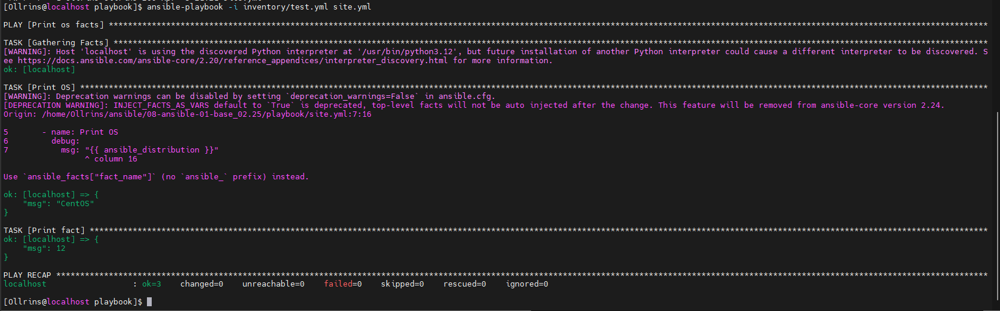
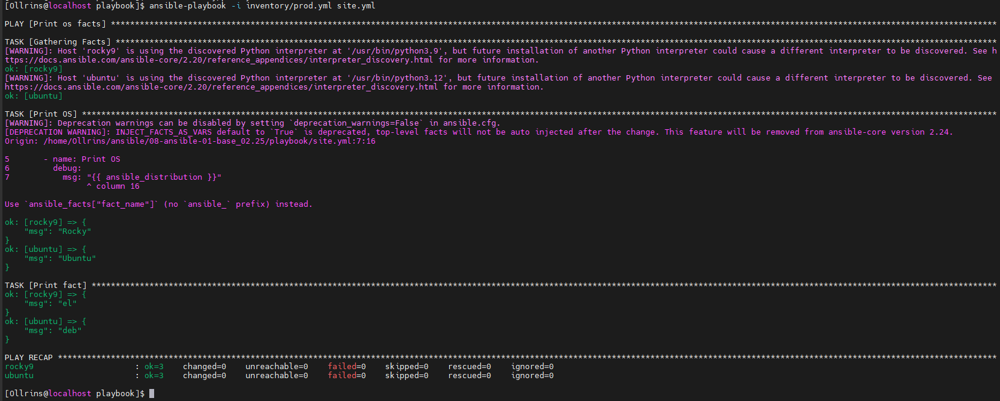
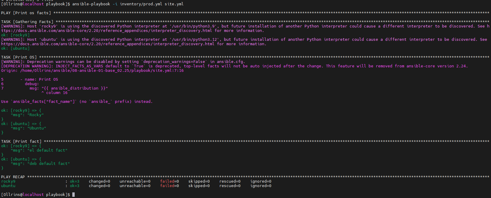
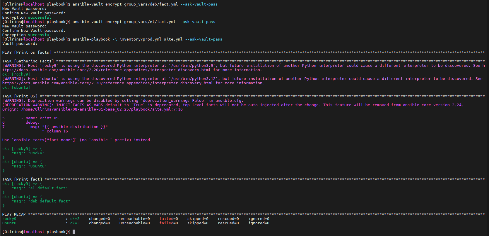
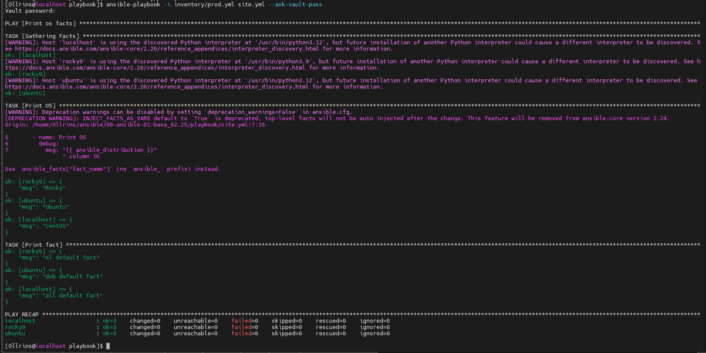
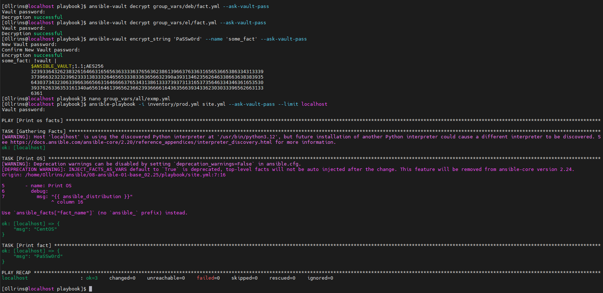
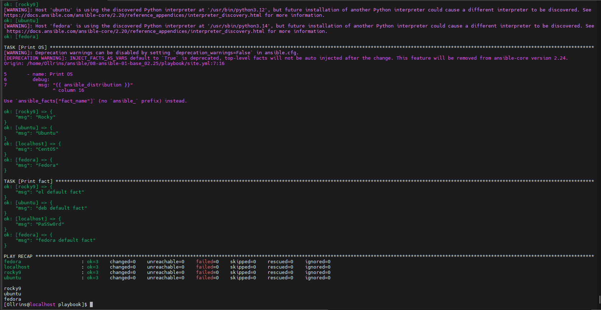

# Ansible-intro

### Домашнее задание к занятию 1 «Введение в Ansible»

#### Задание 1

<br>
<p align="center">
  
  <br>
  <em> some_fact для указанного хоста при выполнении playbook = 12 </em>
</p>

#### Задание 4

<p align="center">
  
  <br>
  <em> значения some_fact для каждого из managed host</em>
</p>

#### Задание 6

<p align="center">
  
  <br>
  <em>  запуск playbook на окружении prod.yml </em>
</p>

#### Задание 8

<p align="center">
  
  <br>
  <em>playbook на окружении prod.yml,  при запуске ansible запрашивает пароль</em>
</p>

#### Задание 11

<p align="center">
  
  <br>
  <em>факты some_fact для каждого из хостов определены из group_vars </em>
</p>

#### Задание 2.2

<p align="center">
  
  <br>
  <em>зашифровано значение PaSSw0rd для переменной some_fact паролем netology</em>
</p>

#### Задание 2.5

<p align="center">
  
  <br>
  <em>запуск ansible-playbook и остановка контейнеров скриптом</em>
</p>
<br>
[Исходный код](https://github.com/Ollrins/Ansible-intro/tree/main/playbook "Ссылка на GitHub")
<br>
<br>


```bash
# Шифрование файлов с паролем netology
ansible-vault encrypt group_vars/deb/fact.yml --ask-vault-pass
# Запуск playbook с расшифровкой
ansible-playbook -i inventory/prod.yml site.yml --ask-vault-pass
# Пароль: netology
# Список всех плагинов подключения
ansible-doc -t connection -l
# Проверка структуры инвентаря
ansible-inventory -i inventory/prod.yml --graph
# Расшифровка файлов с переменными
ansible-vault decrypt group_vars/deb/fact.yml --ask-vault-pass

# Шифрование отдельного значения PaSSw0rd. Создание зашифрованного значения для строки PaSSw0rd
ansible-vault encrypt_string 'PaSSw0rd' --name 'some_fact' --ask-vault-pass
# Пароль: netology

# Добавление зашифрованного значения в group_vars/all/exmp.yml
cat >> group_vars/all/exmp.yml << 'EOF'
---
some_fact: !vault |
          $ANSIBLE_VAULT;1.1;AES256
          [полученная_зашифрованная_строка]
EOF
# Проверка для localhost
ansible-playbook -i inventory/prod.yml site.yml --ask-vault-pass --limit localhost
# Результат: localhost → "PaSSw0rd"
```

